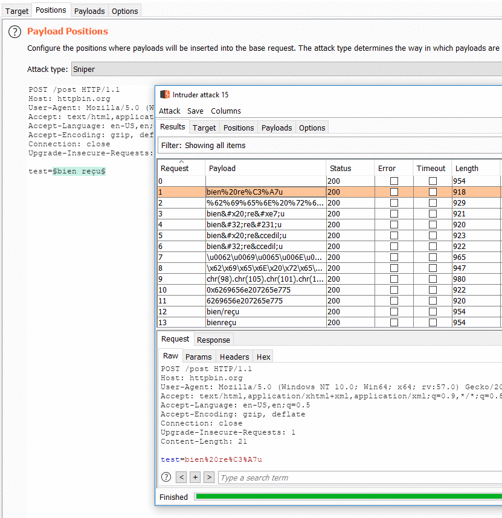

# Fuzzy Encoding Generator (Burp Extension)

This extension allows a user to quickly test various encoding for a given value in Burp Intruder.

## How to use:

1. Select a portion of a request in Intruder.
2. Choose "Fuzzy Encoding Generator" as source for this place holder.
3. Launch attack

## Demonstration

